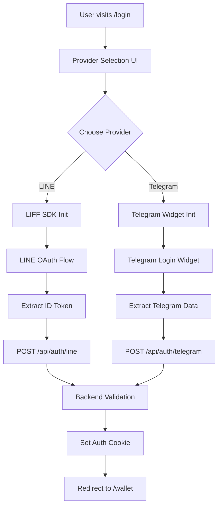

# Telegram + LINE Dual Authentication Architecture

## 🎯 **Feature Specification**

**Goal**: Add Telegram Login as a second authentication method alongside existing LINE OAuth, allowing users to choose their preferred login method for wallet access.

## 🏗️ **System Architecture Design**

### **1. Authentication Provider Abstraction**

```typescript
// New Provider Interface
interface AuthProvider {
  name: 'line' | 'telegram'
  initialize(): Promise<void>
  login(): Promise<AuthResult>
  logout(): void
  isAvailable(): boolean
}

interface AuthResult {
  provider: 'line' | 'telegram'
  token: string
  userData: {
    id: string
    email?: string
    name?: string
    avatar?: string
    username?: string
  }
}
```

### **2. Frontend Component Structure**

```
app/
├── login/
│   ├── page.tsx                    # Updated with provider selection
│   └── components/
│       ├── ProviderSelector.tsx    # NEW: Choose LINE/Telegram
│       ├── LineLoginButton.tsx     # Extracted from current page
│       └── TelegramLoginButton.tsx # NEW: Telegram Login Widget
├── providers/
│   ├── auth-provider.tsx          # Updated for multi-provider
│   └── auth-providers/            # NEW: Provider implementations
│       ├── line-auth.ts
│       └── telegram-auth.ts
```

### **3. Backend API Architecture**

```
app/api/auth/
├── [provider]/
│   └── route.ts                   # Dynamic provider routes
├── me/
│   └── route.ts                   # Updated with provider info
└── logout/
    └── route.ts                   # Provider-agnostic logout

src/server/services/
├── auth/
│   ├── auth.service.ts           # Unified auth service
│   ├── providers/
│   │   ├── line-provider.ts      # LINE OAuth logic
│   │   └── telegram-provider.ts  # Telegram auth logic
│   └── interfaces/
│       └── auth.interfaces.ts    # Shared types
```

### **4. Database Schema Updates**

```sql
-- PocketBase users collection updates
users {
  id: string
  email: string
  name: string
  avatar: string
  provider: 'line' | 'telegram'     # NEW
  provider_id: string               # NEW: Original provider user ID
  username: string?                 # NEW: For Telegram usernames
  created: datetime
  updated: datetime
}

-- Optional: Social profiles collection for future expansion
user_social_profiles {
  id: string
  user_id: string                   # Foreign key to users
  provider: 'line' | 'telegram'
  provider_id: string
  provider_data: json              # Store provider-specific data
  created: datetime
}
```

## 🔄 **Authentication Flow Design**

### **Frontend Flow**


### **Backend Provider Validation**

```typescript
// LINE Provider Validation
interface LineUserData {
  sub: string        # LINE user ID
  email: string      # Email address
  name?: string      # Display name
  picture?: string   # Avatar URL
}

// Telegram Provider Validation  
interface TelegramUserData {
  id: number         # Telegram user ID
  first_name: string # First name
  last_name?: string # Last name
  username?: string  # Username
  photo_url?: string # Avatar URL
  auth_date: number  # Authentication timestamp
  hash: string       # Data hash for verification
}
```

## 🎨 **UI/UX Design Patterns**

### **1. Login Page Layout**
```jsx
<LoginPage>
  <Header>Welcome to ARIS Wallet</Header>
  <ProviderSelector>
    <LineLoginButton />
    <TelegramLoginButton />
  </ProviderSelector>
  <SecurityBadges />
</LoginPage>
```

### **2. Provider Selection Component**
```jsx
<ProviderSelector>
  <ProviderOption provider="line">
    <Icon>LINE Logo</Icon>
    <Title>Continue with LINE</Title>
    <Description>Use your LINE account</Description>
  </ProviderOption>
  
  <ProviderOption provider="telegram">
    <Icon>Telegram Logo</Icon>
    <Title>Continue with Telegram</Title>
    <Description>Use your Telegram account</Description>
  </ProviderOption>
</ProviderSelector>
```

### **3. Responsive Design**
- **Mobile-first** approach
- **Provider buttons** stack vertically on mobile
- **Consistent styling** with existing app theme
- **Loading states** for each provider
- **Error handling** per provider

## 🔐 **Security Architecture**

### **1. Telegram Authentication Security**
```javascript
// Telegram data verification
function verifyTelegramAuth(data, botToken) {
  const hash = data.hash;
  delete data.hash;
  
  const dataCheckString = Object.keys(data)
    .sort()
    .map(key => `${key}=${data[key]}`)
    .join('\n');
    
  const secretKey = crypto.createHash('sha256')
    .update(botToken)
    .digest();
    
  const computedHash = crypto.createHmac('sha256', secretKey)
    .update(dataCheckString)
    .digest('hex');
    
  return computedHash === hash;
}
```

### **2. Provider-Specific Validation**
- **LINE**: Verify ID token with LINE API
- **Telegram**: Verify hash signature with bot token
- **Unified**: Create secure session cookies
- **Rate Limiting**: Per provider and per IP

### **3. Session Management**
```typescript
interface AuthSession {
  userId: string
  provider: 'line' | 'telegram'
  providerId: string
  expiresAt: Date
  walletAddress?: string
}
```

## 📱 **Environment Configuration**

### **Required Environment Variables**
```env
# Existing LINE OAuth
LINE_CLIENT_ID=2007610205
LINE_CLIENT_SECRET=48499fcdd760a2c0a57a75980d802f2b
NEXT_PUBLIC_LIFF_ID=2007610205-yJOrxJdk

# New Telegram OAuth
TELEGRAM_BOT_TOKEN=your_bot_token_from_botfather
NEXT_PUBLIC_TELEGRAM_BOT_USERNAME=your_bot_username
TELEGRAM_WEBHOOK_SECRET=optional_webhook_secret

# Auth Configuration  
ALLOWED_AUTH_PROVIDERS=line,telegram
DEFAULT_AUTH_PROVIDER=line
```

## 🧪 **Testing Strategy**

### **Unit Tests**
- Provider authentication logic
- Token validation functions
- User creation/authentication flows
- Error handling scenarios

### **Integration Tests**
- Full authentication flows for both providers
- Provider switching scenarios
- Session management
- Database operations

### **E2E Tests**
- Complete login flows
- Provider selection UI
- Error handling and fallbacks
- Mobile responsive behavior

## 🚀 **Migration Plan**

### **Phase 1: Foundation**
1. Create provider abstraction interfaces
2. Extract LINE logic into provider module
3. Update AuthProvider for multi-provider support

### **Phase 2: Telegram Integration**
1. Implement Telegram provider
2. Add Telegram API route
3. Create Telegram login component

### **Phase 3: UI Enhancement**
1. Build provider selection UI
2. Update login page layout
3. Add loading states and error handling

### **Phase 4: Testing & Polish**
1. Comprehensive testing suite
2. Security audit
3. Performance optimization
4. Documentation updates

## 📊 **Success Metrics**

- **Functional**: Both LINE and Telegram auth work independently
- **Security**: All authentication flows are secure and validated
- **UX**: Smooth provider selection and login experience  
- **Performance**: No degradation in auth speed
- **Maintainable**: Clean, modular code structure

This architecture provides a solid foundation for adding Telegram authentication while maintaining the existing LINE OAuth functionality and preparing for future authentication providers.